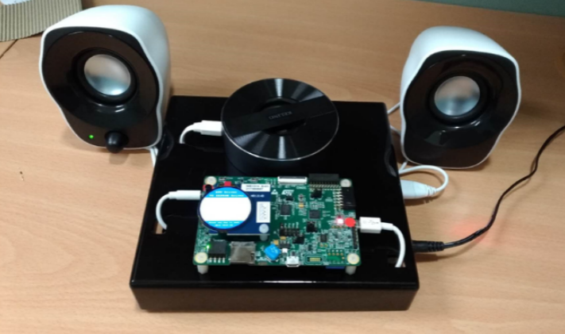

Overview
========
This demo shows the performace of Octa Flash memory on the STM32L4R9I Discovery board by switching between 
all tests using key button. There are 4 scenario tests to demonstrate Octa Flash read-while-write features. 
The Macronix Octa flash is used so far to provide higher data throughput and to extend the MCU on-chip memory, 
solving the memory size and the performance limitation.

Recommeded toolchain
====================
- Atollic TrueStudio 9.0.0

Hardware requirements
=====================
- Micro USB cable
- 3.5mm audio interface cable
- STM32L4R9I Discovery board
- Audio/speaker system (JBL GO)
- STM32 LCD module (MB134C)
- Macronix Read-While-Write Octa Flash

Four scenarios demo
===================
- 1x speed play back
- 2x speed play back
- NonRWW Driver VS RWW Driver
- RWW Driver VS EEPROM emulation with RWW Driver

Prepare the Demo
================
1.  Connect a 3.5mm audio interface cable between the Discovery board and the Audio system. 
2.  Plug the LCD module on development board.
3.  Use a Micro USB cable to power on the development board.
4.  Download the program to the target board.
5.  Either press the reset button on your board or launch the debugger in your IDE to begin running the demo.
6.  Press the right joystick continuously to process the demo according to the log on LCD.

Running the demo
================
1. When the first 2 scenarios runs successfully, you can see the audio playback performance.
2. Press the right joystick, enter next senario, you can see RWW Driver use less time than NonRWW Driver.
3. The last senario, EEPROM emulation with RWW Driver use less time than RWW Driver.

